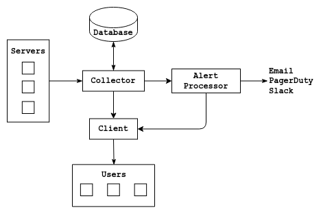

# SyMon

 

SyMon is a simple Linux system monitoring tool written in Go. Primarily created for monitoring smaller servers, home PCs, and devices like Raspberry Pi, but it is now extended to support full fledged system level monitoring on Linux systems. SyMon also supports custom time series data collection. Which can be used to collect sensor, or application output/performance data. 

Currently, it gathers following metrics under the monitoring interval given in the configuration file. 

* System Info
* CPU Info
* Memory/SWAP info
* CPU/Memory usage graphs for past hour (default) or custom time range
* Disk usage and usage graphs
* Network usage info and graphs
* Endpoint monitoring with support for GET and POST requests
* Whether a service is running or not
* 10 processes running on the system sorted by CPU or Memory usage
* Custom metrics (time series data) collection and graphs
* Showing metrics graphs in custom time/date ranges
* Point-in-time data loading of processes for CPU/Memory usage 
* Alert setup for CPU/Memory/SWAP/Disk/Services/Custom metrics 
    * Push alerts to user via Email, PagerDuty, or Slack
* Custom data retention period

### Screenshots

## Customizations
Communication between components (agents, collector, frontend, and alertprocessor) is done using gRPC. A custom service can be set up to read or push data into any of the components if needed. [API](internal/api/api.proto), [Alert API](internal/alertapi/alertapi.proto)

## Components
SyMon has four major components users can use to collect metrics and process alerts. 

### Agent
Agent has to be installed in the system you want to monitor. Once it is installed and configured, it will collect and send out metrics to the Collector in a given collection interval. It also can be used to send out custom metrics to the Collector. Custom metrics can be used to collect application, process data, or sensor data periodically through cron job or script/application.

### Collector
The Collector is a required component of SyMon. Collector requires MariaDB version >= 10.5 to store the data which is sent to it by collectors. Once set up, it can collect monitor data from multiple servers. It also checks alerts given by the alert config file. If an alert is raised, status changed, or resolved it will push them to the Alert processor. Collected monitor data will be purged every 60 days by default. However, it can be configured through the config file. 

### Alert Processor
Alert processor is an optional component of SyMon. You can skip the Alert processor if you wish only to collect and visualize metrics and custom data. However, if you wish to set up alerts, you can use the Alert processor to push out incoming alerts or alert status changes to Email, PagerDuty, and Slack. The UI element, or the Client component of SyMon also uses the Alert processor to get raised alerts. 

### Client
Client component is the user interface component of SyMon which is accessible from browsers. It requests data from the Collector and displays data as graphs or tables. It also can be used to see which are the active servers and which are not active or have trouble connecting to the Collector. 

Client component can show all collected data as tables or graphs, which includes the custom metrics pushed by the agents. Currently this does not require any user authentication, but authentication and HTTPS can be set up using Apache or nginx. Which is recommended if this is used in public networks. 

## Installing and usage

### TLS support

Communication between Agent, Collector, Alertprocessor, and Client can be encrypted using TLS. Respective `.env-example` files can be referred to set up the server certificate, server private key (Collector, Alertprocessor), and CA file (Agents, Collector, Client) related environment variables.

Server certificate and the private key is needed with Collector and Alertprocessor if TLS is used. Agents and Clients need the CA file to communicate with them.

Collector also needs the CA file of the Alertprocessor's server certificate if TLS is used with the Alertprocessor to push the alerts to ther processor.

Communication between the Client and end user should be encrypted using Apache/nginx.

### Collector

First step is to install MariaDB (`version >= 10.15`) and create a database. Once it is set up, environment variables as per the `.env-example` file should be set up with the required configurations. Which includes database name, user, password, and host information. `alerts.json` should be used to set up alerting rules. Setting up alert rules is optional and can be skipped if alerting is not used. 

Once everything is set up, you have to initialize the collector by running the below command. It will create the database tables and print the `key` string as well as set the `key` as an environment variable `SYMON_KEY`.

`./collector_linux_x86_64 --init`

Once initialized, you can run the collector by running below command. It is best to set this up as a service. Example can be find [here](https://github.com/dhamith93/SyMon/tree/master/custom_scripts).

`./collector_linux_x86_64`

### Agents
You should first install Collector, initialize, and set the `SYMON_KEY` environment variable with the key to install the agent.

Once all the relevent environment variables in the `.env-example` file is set up. You can register the agent to the Collector by running the below command. 

`./agent_linux_x86_64 -init`

Once initialized, run the agent (preferably as a service) to enable the metrics collection. 

### Custom metrics
Custom time series data can be added using the agent as below. Current server time will be taken as the time. Running the below command with the parameters will send out the data to the Collector. This can be done manually, using a cron job, or through an application. 

`./agent_linux_x86_64 -custom -name=test -unit=byte -value=1.0`

`./agent_linux_x86_64 -custom -name='active-http-requests' -unit='requests' -value=$(netstat | grep -c https)`

### Alerts
This is an optional part of SyMon. It is only needed if you need to process alerts and push them out to Email, PagerDuty, and Slack. 

Set up the environment variables as shown in `.env-example` file with configurations and API credentials for PagerDuty/Slack and run the Alert processor.

`./alertprocessor_linux_x86_64`

### Clients
To run the Client, fill the relevent environment variables as shown in `.env-example` and start the Client with the below command. You can use Apache, or nginx to set up SSL and user authentication if needed.

`./client_linux_x86_64`

### API documentation
Client also exposes an REST API to retrieve collection data. 
#### End points
* `/system`
    * Returns system info
* `/memory`
    * Returns memory info/usage
* `/swap`
    * Returns swap info/usage
* `/disks`
    * Return disk info/usage per disk
* `/network`
    * Return disk info/usage per interface
* `/processes`
    * Returns list of processes using most CPU/RAM 
* `/processor-usage-historical`
    * CPU load avg
* `/memory-historical`
    * Memory usage
* `/services`
    * List of services enabled to monitor in agent's service.json
* `/custom-metric-names`
    * Names of custom metrics
* `/custom?custom-metric=name`
    * Custom metric values
* Required GET parameters
    * `serverId=` ID of the server
* Optional GET parameters
    * `from=[unix timestamp]&to=[unix timestamp]` values within a time range
    * `time=[unix timestamp]` value(s) at a certain time (depends on availability of data)
