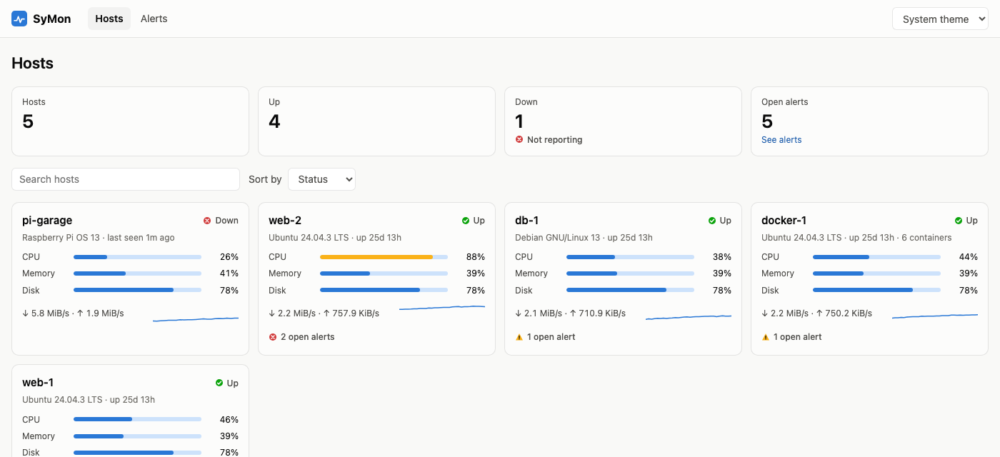
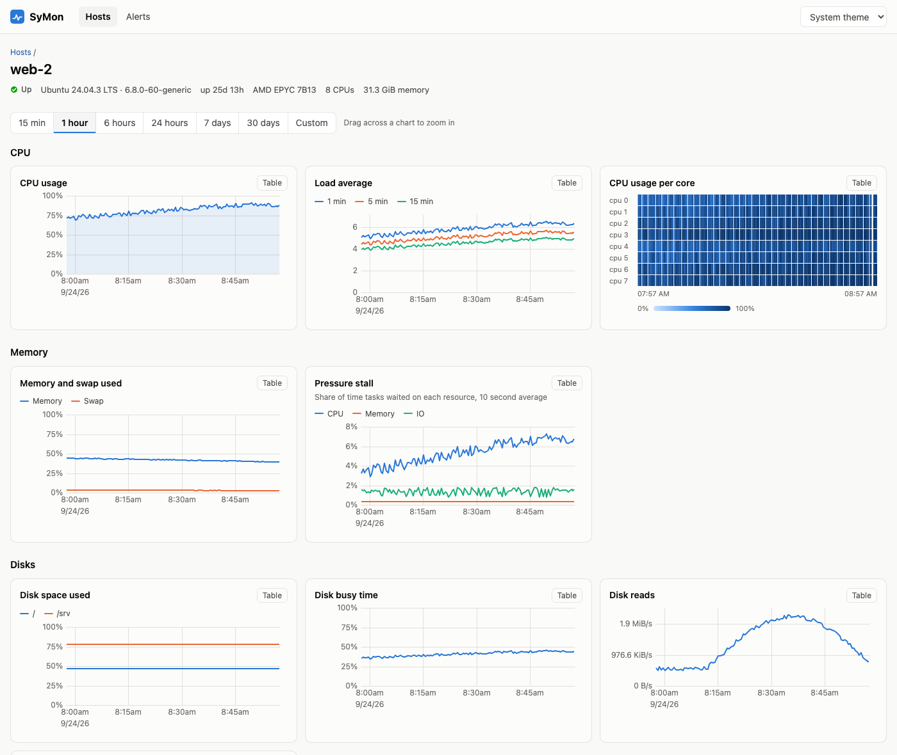
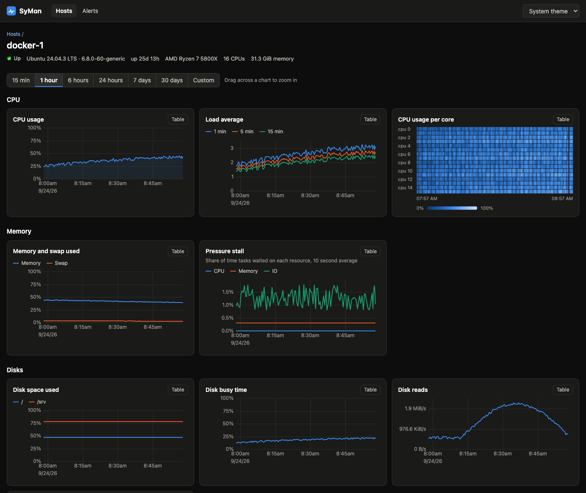
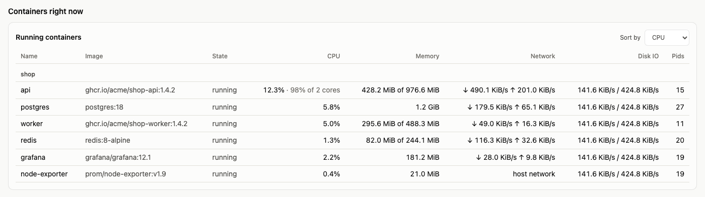
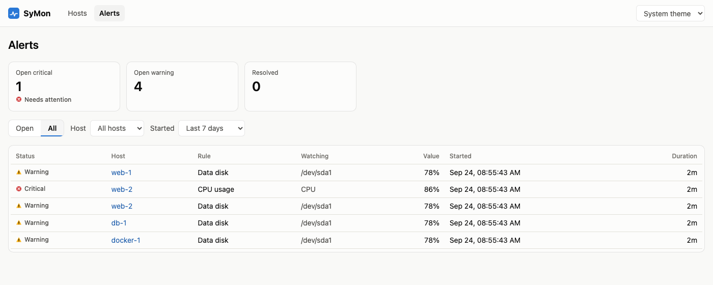
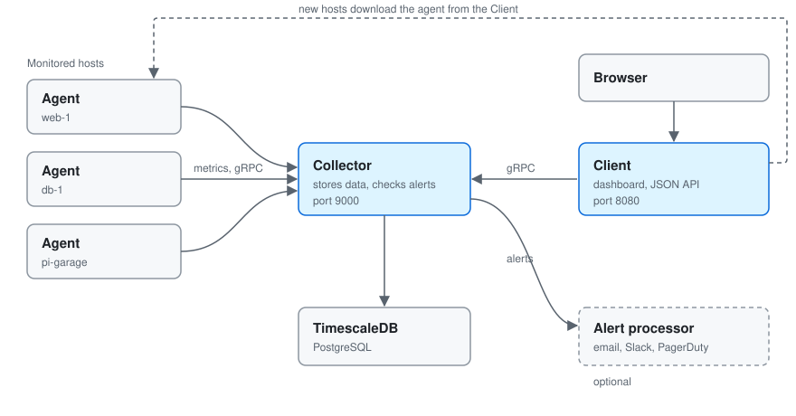

# SyMon

 

SyMon is a self-hosted monitoring tool for Linux servers, home labs and Raspberry Pis. A small agent on each host sends its metrics to one server, which keeps the history in TimescaleDB, raises alerts, and shows everything on a web dashboard.

## Features

**Hosts**
- CPU, overall and per core, load average, memory and swap
- Disk space, disk IO and busy time, network traffic, TCP connections
- Pressure stall information and temperature sensors
- The top processes by CPU and memory, at any point in time
- Whether chosen systemd services are running

**Containers**
- Every running container on a host: Docker, Podman, containerd, LXC and systemd-nspawn
- CPU, memory, network and disk IO per container, grouped by Compose project

**Custom metrics**
- Send any number from a script or cron job and get a chart for it

**Alerts**
- Rules for CPU, memory, swap, disks, services, custom metrics, silent hosts and HTTP endpoints
- Warning and critical levels, shown on the dashboard and sent by email, Slack or PagerDuty

**Dashboard**
- Every host at a glance, and a page per host with charts from 15 minutes to 30 days, or any custom range
- Drag across a chart to zoom in, and switch any chart to a table
- Follows the system light or dark theme

**Running it**
- Add a host with one command, with a single-use token
- Raw data kept for 7 days, 1 minute averages for 30 days and 1 hour averages for a year, all adjustable
- Each host has its own key, and components can talk over TLS

## Screenshots

## Getting started

The **[install guide](docs/install.md)** covers setting up the server, adding hosts, alerts, upgrades, backups and troubleshooting.

In short:

1. Install PostgreSQL with TimescaleDB and create a database.
2. Build the bundles with `make pack-all`, and extract the collector and client on the server.
3. Put the settings in `/etc/symon/collector.env` and `/etc/symon/client.env`, run `collector -init`, and start both with the units in [custom_scripts](custom_scripts).
4. Run `collector -enroll-token` and paste the command it prints on each host you want to monitor.

## Components

### Agent
Runs on every monitored host as root and sends a snapshot to the Collector every 15 seconds when installed with the script (`SYMON_MONITOR_INTERVAL_SECONDS`). It also sends custom metrics:

`sudo /opt/symon/agent/agent -custom -name=queue-length -unit=jobs -value=42`

### Collector
Receives data from agents, stores it in TimescaleDB, and checks the alert rules. It updates the database schema by itself when it starts. It listens on port 9000.

### Client
The web dashboard and its JSON API, on port 8080. It reads everything from the Collector. It also serves the install script and agent builds that new hosts download. The dashboard has no login, so keep it on a private network or put nginx or Apache in front of it.

### Alert processor
Optional. The Collector sends it alerts as they open, change and resolve, and it passes them on to email, Slack and PagerDuty. Alerts show on the dashboard without it.

## Security

- **Agent keys.** Each enrolled host gets its own key, stored hashed on the server. It can only send data, and only as that host. `collector -remove-agent <name>` revokes it.
- **Shared key.** The Collector, Client and Alert processor use a shared key from `collector -init`. Each call carries a short-lived token signed with it.
- **TLS.** Traffic between components can be encrypted. See the `*_TLS_*` and `*_CERT_PATH` settings in each component's `.env-example`.
- **Dashboard.** Use a reverse proxy for HTTPS and a login.

## Local development

`docker compose up --build` starts TimescaleDB, the Collector, the Alert processor, the Client on http://localhost:8080 and one Agent. The Agent reports on its own container, not the host. The stack is for development only.

Building needs Go 1.26 and Node.js 22 or newer.

- `make build-all` builds every component, with the dashboard embedded in the Client.
- `go test ./...` runs the Go tests. The store tests run against a real database when `SYMON_TEST_DATABASE_URL` is set.
- `npm run dev` in `client/web` serves the dashboard with live reload against a Client on port 8080. `npm test` and `npm run e2e` run its tests.

Components talk over gRPC, so other tools can read from or push into them. See the [API](internal/api/api.proto) and [alert API](internal/alertapi/alertapi.proto).

## API documentation

The Client exposes a JSON API under `/api/v1`. Times are unix seconds. Errors return a JSON body `{"error": "..."}` with a 4xx or 5xx status.

* `GET /api/v1/fleet`
    * Every host with its status, latest usage, number of running containers and number of open alerts
* `GET /api/v1/hosts/{host}`
    * The host's latest snapshot as the agent sent it, with `up` and `lastSeen`
* `GET /api/v1/hosts/{host}/series?metric=cpu&from=&to=`
    * A metric over time. `from` and `to` default to the last hour. `label` keeps one series (a mount point, interface, sensor, container or custom metric name), `maxPoints` sets the most points per series (default 1000) and `max=1` returns the peak of each bucket instead of the average
    * Metrics: `cpu`, `cpu_core`, `load1`, `load5`, `load15`, `memory`, `memory_used`, `swap`, `swap_used`, `psi_cpu`, `psi_memory`, `psi_memory_full`, `psi_io`, `psi_io_full`, `tcp_established`, `tcp_time_wait`, `tcp_close_wait`, `tcp_listen`, `tcp_total`, `disk_used`, `disk_inodes`, `disk_read`, `disk_write`, `disk_util`, `net_rx`, `net_tx`, `temperature`, `custom`, `container_cpu`, `container_memory`, `container_rx`, `container_tx`, `container_io_read`, `container_io_write`
* `GET /api/v1/hosts/{host}/processes?at=`
    * Top processes by CPU and by memory at or before `at`, or the latest
* `GET /api/v1/hosts/{host}/custom-metrics`
    * Names of the host's custom metrics
* `GET /api/v1/alerts?host=&open=1&from=&to=`
    * Alerts, newest first. `open=1` leaves out resolved ones
