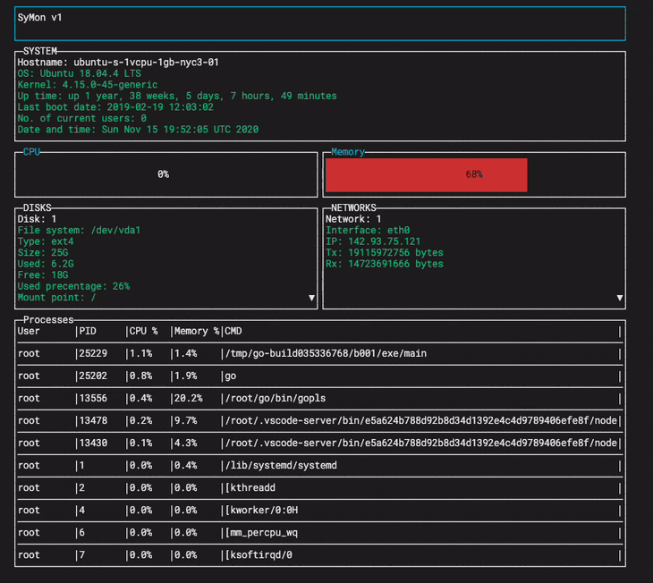

# SyMon
A simple system monitoring tool to monitor local and remote systems. 

## Screenshot

## Usage

Before use, rename or copy `config-example.json` as `config.json` and modify required options

If you are connecting to remote servers, rename or copy `remote-example.json` as `remote.json` and enter relevent server info. Multiple servers can be set up in the `remote.json`.

`key` file will be generated upon the first run. It will contain the API key to connect to the server.

### Execution
* `-server=false` Disables the server. Default `true`
* `-display` Shows the TUI with stats for local machine. Default `false`
* `-monitor=name` Shows the TUI with stats for selected remote server. Requires a valid `remote.json` file

### Keyboard shortcuts on TUI
* `d` Scroll down on disks 
* `D` Scroll up on disks
* `n` Scroll down on networks
* `N` Scroll up on networks
* `p` Switch between process list sorting (memory usage / cpu usage)
* `q` Quit TUI

### API
* `.../system` Returns system info
* `.../memory` Returns memory info
* `.../swap` Returns swap info
* `.../disks` returns json array of disk info
* `.../proc` Return CPU info
* `.../network` Return json array of network interface info
* `.../memusage` Return json array of 10 processes using most memory
* `.../cpuusage` Return json array of 10 processes using most CPU
